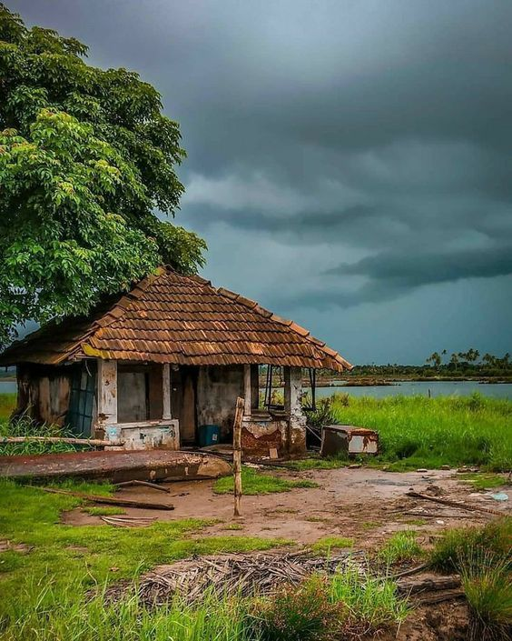
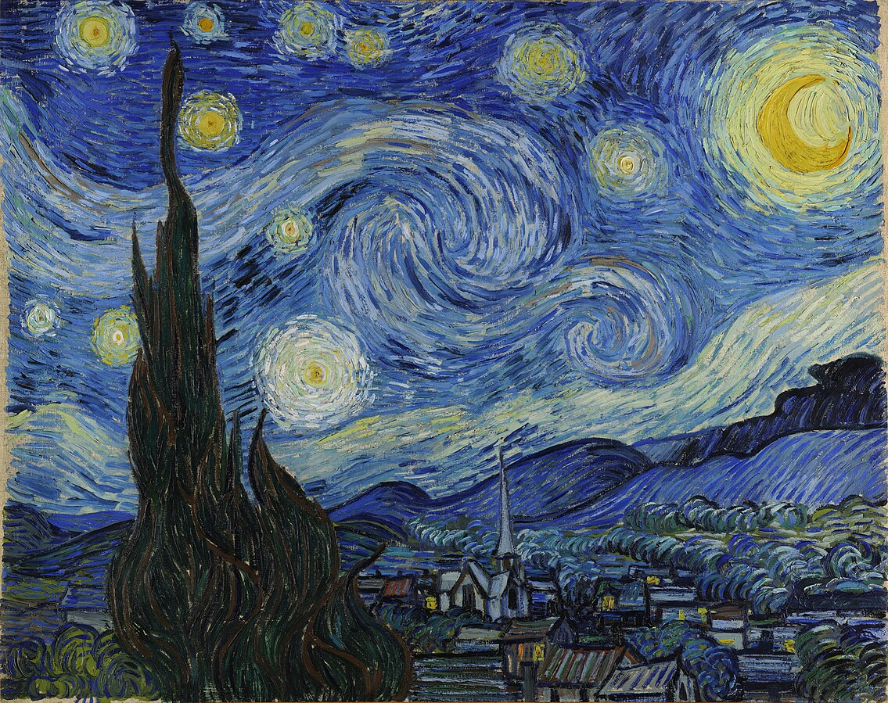
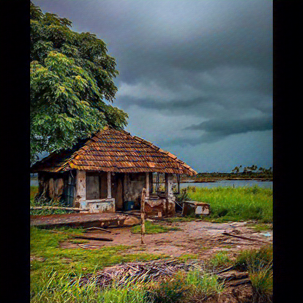

# 🎨 Neural Style Transfer App

Turn your photos into stunning artwork using deep learning!  
Built with **PyTorch**, **Gradio**, and deployed on **Hugging Face Spaces**.

---

## 🚀 Demo

👉 [Launch on Hugging Face](https://huggingface.co/spaces/abhinavkartikeya/neural-style-transfer)

---

## 🧠 What It Does

This app blends two images:
- A **content image** (e.g. village photo)
- A **style image** (e.g. Starry Night, Mosaic)

Using a pre-trained **VGG19** model, it creates a new image that mimics the style while preserving the content.

---

## ✨ Features

- ✅ Upload your own content and style images
- 🎨 Choose from classic presets (Starry Night, Mosaic, The Scream...)
- ⚙️ Control image size, steps, and style weight
- 🧠 Based on neural style transfer (Gatys et al.)
- 🚀 One-click deploy on Hugging Face

---

## 🖼️ Example Output

| Content | Style (Starry Night) | Stylized Output |
|---------|----------------------|-----------------|
|  |  |  |

---

## 📂 Folder Structure

